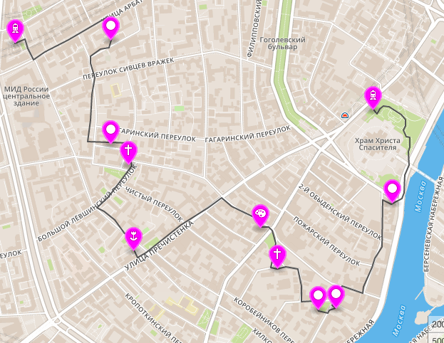

# Geojson Valentina Zhukova
## Маршрут прогулки по «Золотой миле» Москвы :runner:

Вот как он выглядит :feet:

:pushpin: Взят с сайта [How to green](https://howtogreen.ru/posts/754-route-in-moscow-1/).
Это прогулка на 7 км, или примерно 10 тысяч шагов. В каждой точке маршрута есть комментарии, чем она интересна. Они содержатся в разделе Comments. Маршрут начинается на станции метро Кропоткинская и заканчивается на станции метро Смоленская.  
  
